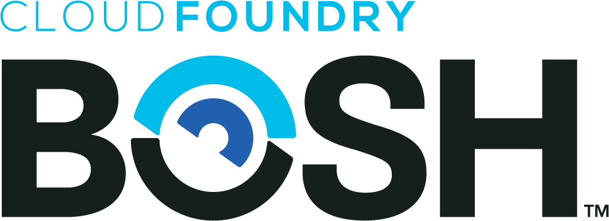

BOSH is a project that unifies release engineering, deployment, and lifecycle management of small and large-scale cloud software. BOSH can provision and deploy software over hundreds of VMs. It also performs monitoring, failure recovery, and software updates with zero-to-minimal downtime.

While BOSH was developed to deploy [Cloud Foundry PaaS](https://www.cloudfoundry.org/application-runtime/), it can also be used to deploy almost any other software (Hadoop, for instance). BOSH is particularly well-suited for large distributed systems. In addition to deploying entire platforms, BOSH supports deploying those platforms to multiple infrastructures - both on-premise and public cloud (or even your own workstation).
